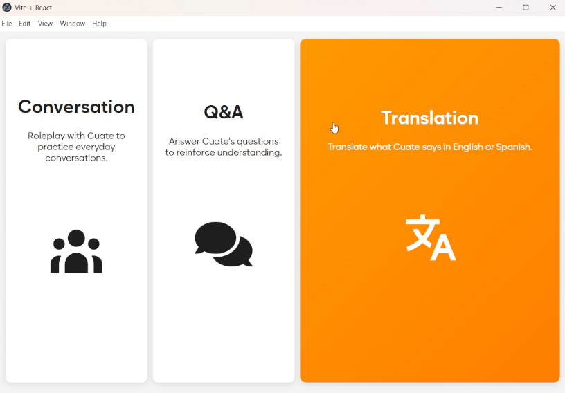

# Tu-Cuate / Spanish Speech Evaluater
A short description of what your project does.

---

## Table of Contents
- [Installation](#installation)
- [Usage](#usage)
- [Features](#features)
- [Screenshots](#screenshots)
- [Technologies](#technologies)
- [Contributing](#contributing)
- [License](#license)

## Installation

## Feature 1 - Speech Grader

## Feature 2 - Machine Learning Similarity Analyist

## Technologies

