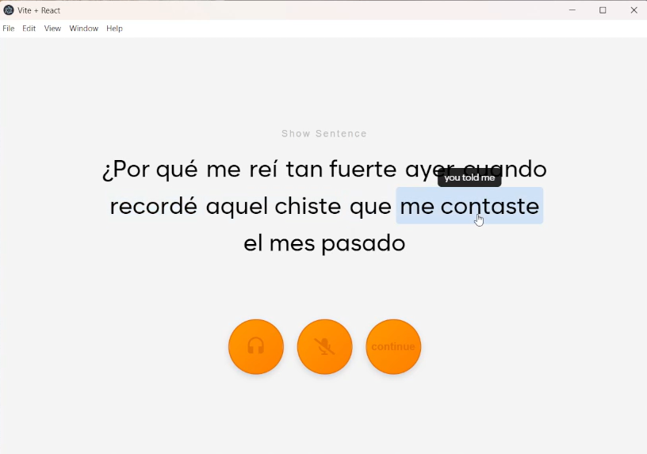

# Tu-Cuate / Spanish Speech Evaluater
A Spanish Practice Speaking App that allows the user to practice there oral and listening spanish skills and corrects the mistakes that the speaker had send and gives them better alternatives

---

## Table of Contents
- [Installation](#installation)
- [Usage](#usage)
- [Features](#features)
- [Screenshots](#screenshots)
- [Technologies](#technologies)
- [Contributing](#contributing)
- [License](#license)

## Installation

## Getting Started

There are <strong>TWO</strong> main features with this app. Speech Grader (Q & A and Translations) and Machine Learning Similarity Analyist (Analysis). Once the User starts the app, it will ask them to enter one of these two types of modes.

  

## Feature 1 - Speech Grader

---

If you select either the **Q&A** or **Translation** features of the app, it will take you to its main functionality.  

  

On the left, you will see a settings menu that allows you to edit the type of questions you’ll be asked.  
For example: which verbs to focus on, which conjugation tense, which pronouns to include, CEFR level,  
and the length of the response. Selections will be randomized within each category.  

  

Once the user starts, a random question will be generated. The question is initially hidden—  
to hear it, click the **headphone button**.  

  

If the user needs to read the question, they can uncheck the hidden option.  
If they don’t know a word or phrase, they can highlight it to see its translation.  

  

To respond, press the **microphone button** once to start recording (it turns red).  
Press it again to stop. Then press **Continue** to move to the next step.  
If not satisfied, simply record again.  

  

After recording, the app will correct what you said and highlight mistakes.  

  

  

  

  

## Feature 2 - Machine Learning Similarity Analyist

  To view your Spanish-speaking analysis, first select a date range.
  You can choose from <b>Today</b>, <b>7 Days</b>, <b>30 Days</b>, or <b>All Time</b>.
  After that, your analysis will be displayed.

  

---

  First, a pie chart is displayed showing all the errors you made within the selected timeframe, organized by the <b>number of errors</b>.
  You can hover over each section to see which areas you need to focus on.

  

  

  Using the SpaCy library, we can calculate similarity scores by comparing the OpenAI correction with the user’s original error, then averaging them by groups.   

  <b>Group Name</b> (Conjugation, Phrase Flow, Pronouns): The first column displayed.  
  <b>Count</b>: The number of errors made by the user.  
  <b>Correctness</b>: The average similarity score for the errors (0–1).  
  <b>Difficulty</b>: The average similarity score that accounts for the overall sentence structure (0–1).  
  <b>Emphasis</b>: A weighted score that considers both the number of errors and the difficulty to determine which group the user should focus on (0–1).   

  For <b>Correctness</b> and <b>Difficulty</b>, the closer the number is to 1, the more similar it is; the closer it is to 0, the more different it is.  
  Example: “Te Querio” and “Te Quieres” might have a similarity score of 0.9, while “Te Quiero” and “estaré allí pronto” might have a score of 0.1.   

  For the <b>Emphasis</b> score, the closer the number is to 1, the more you should prioritize studying that group; the closer it is to 0, the less emphasis it requires.

---

  The chart below displays the emphasis scores, organized by groups to show which areas the user should focus on.  
  <b>High Priority</b> (75%–100%), <b>Medium Priority</b> (50%–75%), <b>Low Priority</b> (25%–50%), <b>Minimal Priority</b> (0%–25%)

  

---

  Finally, a timeline bar chart displays all of your mistakes within the selected timeframe, grouped by category.

  

  

  

---

## Technologies

### Languages 
Python - JavaScript
### Frameworks / Runtimes
React (with Vite) - Electron - FastAPI
### APIs
OpenAPI
### Databases
MongoDB (NoSQL)
### Libraries
Pandas - spaCy - D3.js
### Developer Tools
Git - VSCode

