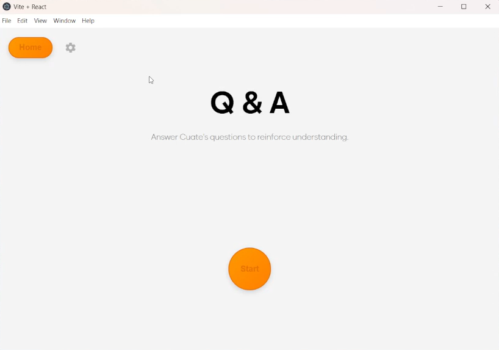

# Tu-Cuate / Spanish Speech Evaluater
A Spanish Practice Speaking App that allows the user to practice there oral and listening spanish skills and corrects the mistakes that the speaker had send and gives them better alternatives

---

## Table of Contents
- [Installation](#installation)
- [Usage](#usage)
- [Features](#features)
- [Screenshots](#screenshots)
- [Technologies](#technologies)
- [Contributing](#contributing)
- [License](#license)

## Installation

## Getting Started

There are <strong>TWO</strong> main features with this app. Speech Grader (Q & A and Translations) and Machine Learning Similarity Analyist (Analysis). Once the User starts the app, it will ask them to enter one of these two types of modes.

  

## Feature 1 - Speech Grader

---

If you select either the **Q&A** or **Translation** features of the app, it will take you to its main functionality.  

  

On the left, you will see a settings menu that allows you to edit the type of questions you’ll be asked.  
For example: which verbs to focus on, which conjugation tense, which pronouns to include, CEFR level,  
and the length of the response. Selections will be randomized within each category.  

  

Once the user starts, a random question will be generated. The question is initially hidden—  
to hear it, click the **headphone button**.  

  

If the user needs to read the question, they can uncheck the hidden option.  
If they don’t know a word or phrase, they can highlight it to see its translation.  

  

To respond, press the **microphone button** once to start recording (it turns red).  
Press it again to stop. Then press **Continue** to move to the next step.  
If not satisfied, simply record again.  

  

After recording, the app will correct what you said and highlight mistakes.  

  

  

  

  

## Feature 2 - Machine Learning Similarity Analyist

  

  

  

  

  

  

  

---

## Technologies

### Languages 
Python - JavaScript
### Frameworks / Runtimes
React (with Vite) - Electron - FastAPI
### APIs
OpenAPI
### Databases
MongoDB (NoSQL)
### Libraries
Pandas - spaCy - D3.js
### Developer Tools
Git - VSCode

